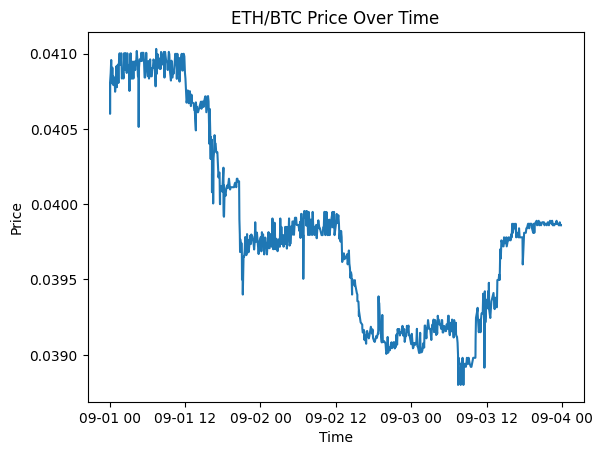
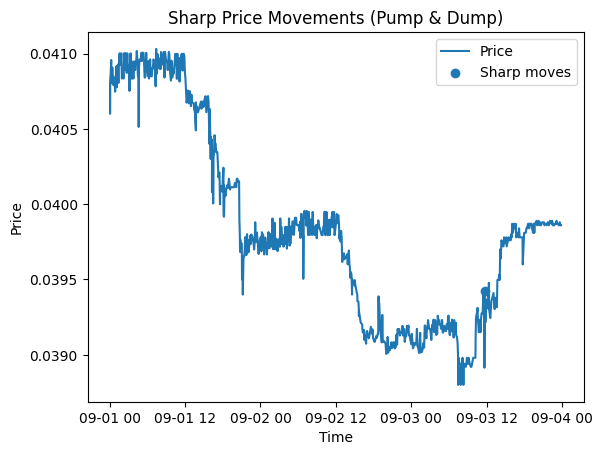
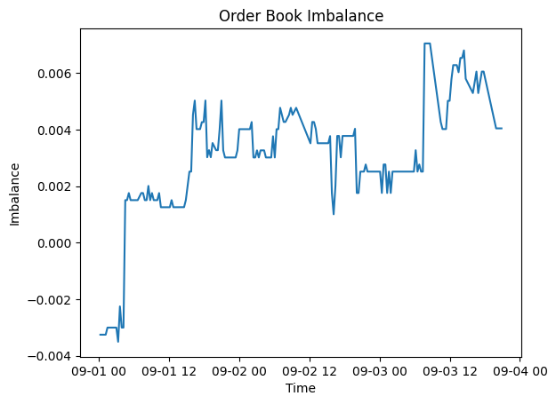
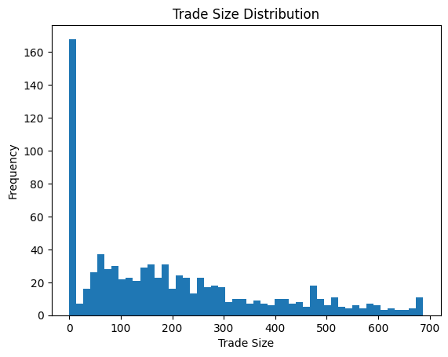
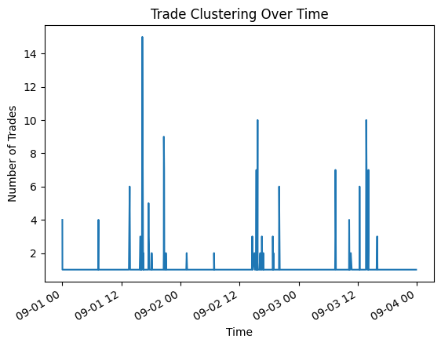
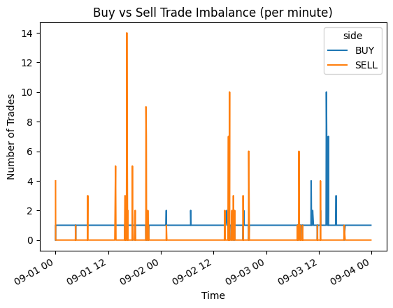
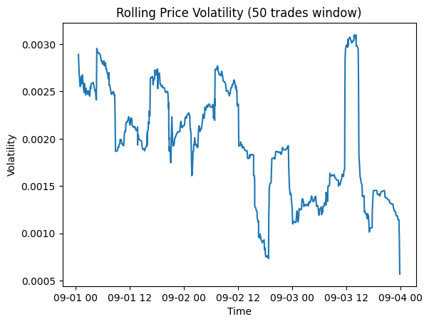
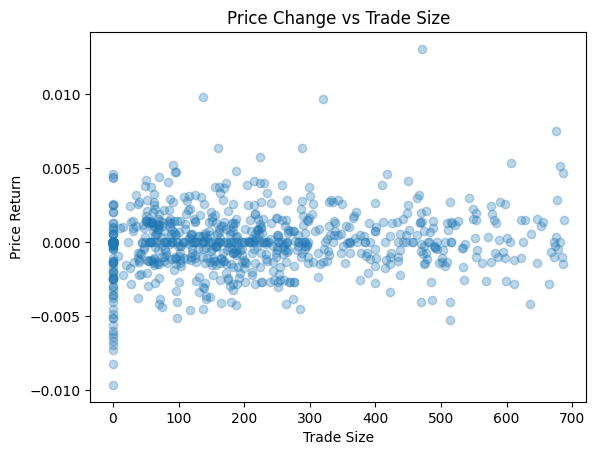

```python
import pandas as pd
import numpy as np
import matplotlib.pyplot as plt

trades = pd.read_csv("data/eth-btc-trades.csv")
orderbook = pd.read_csv("data/eth-btc-orderbooks.csv")
```


```python
print(trades.columns)
print(orderbook.columns)
```

    Index(['timestamp', 'price', 'size', 'side'], dtype='object')
    Index(['timestamp', 'asks', 'bids'], dtype='object')


```python
trades['timestamp'] = pd.to_datetime(trades['timestamp'])
orderbook['timestamp'] = pd.to_datetime(orderbook['timestamp'])
trades = trades.sort_values('timestamp').reset_index(drop=True)
orderbook = orderbook.sort_values('timestamp').reset_index(drop=True)
```


```python
plt.figure()
plt.plot(trades['timestamp'], trades['price'])
plt.title("ETH/BTC Price Over Time")
plt.xlabel("Time")
plt.ylabel("Price")
plt.show()
```


    

    


```python
trades['vol_mean'] = trades['size'].rolling(50).mean()
trades['vol_std'] = trades['size'].rolling(50).std()

trades['volume_zscore'] = (
    trades['size'] - trades['vol_mean']
) / trades['vol_std']
```


```python
volume_anomalies = trades[trades['volume_zscore'].abs() > 3]
volume_anomalies.head()
```


<div>
<style scoped>
    .dataframe tbody tr th:only-of-type {
        vertical-align: middle;
    }

    .dataframe tbody tr th {
        vertical-align: top;
    }

    .dataframe thead th {
        text-align: right;
    }
</style>
<table border="1" class="dataframe">
  <thead>
    <tr style="text-align: right;">
      <th></th>
      <th>timestamp</th>
      <th>price</th>
      <th>size</th>
      <th>side</th>
      <th>vol_mean</th>
      <th>vol_std</th>
      <th>volume_zscore</th>
    </tr>
  </thead>
  <tbody>
    <tr>
      <th>63</th>
      <td>2025-09-01 05:11:35+00:00</td>
      <td>0.041005</td>
      <td>656.08868</td>
      <td>BUY</td>
      <td>185.314476</td>
      <td>149.544989</td>
      <td>3.148044</td>
    </tr>
    <tr>
      <th>201</th>
      <td>2025-09-01 16:31:40+00:00</td>
      <td>0.040305</td>
      <td>674.70365</td>
      <td>BUY</td>
      <td>130.167771</td>
      <td>181.408265</td>
      <td>3.001715</td>
    </tr>
  </tbody>
</table>
</div>


```python
plt.figure()
plt.plot(trades['timestamp'], trades['size'], label='Trade size')
plt.scatter(
    volume_anomalies['timestamp'],
    volume_anomalies['size'],
    label='Abnormal volume',
    marker='o'
)
plt.legend()
plt.title("Abnormal Volume Spikes")
plt.xlabel("Time")
plt.ylabel("Trade Size")
plt.show()
```


    

    


```python
trades['returns'] = trades['price'].pct_change()
```


```python
price_anomalies = trades[trades['returns'].abs() > 0.01]
price_anomalies.head()
```


<div>
<style scoped>
    .dataframe tbody tr th:only-of-type {
        vertical-align: middle;
    }

    .dataframe tbody tr th {
        vertical-align: top;
    }

    .dataframe thead th {
        text-align: right;
    }
</style>
<table border="1" class="dataframe">
  <thead>
    <tr style="text-align: right;">
      <th></th>
      <th>timestamp</th>
      <th>price</th>
      <th>size</th>
      <th>side</th>
      <th>vol_mean</th>
      <th>vol_std</th>
      <th>volume_zscore</th>
      <th>returns</th>
    </tr>
  </thead>
  <tbody>
    <tr>
      <th>716</th>
      <td>2025-09-03 11:43:50+00:00</td>
      <td>0.039422</td>
      <td>470.46088</td>
      <td>BUY</td>
      <td>219.831674</td>
      <td>216.010037</td>
      <td>1.160266</td>
      <td>0.01304</td>
    </tr>
  </tbody>
</table>
</div>


```python
plt.figure()
plt.plot(trades['timestamp'], trades['price'], label='Price')
plt.scatter(
    price_anomalies['timestamp'],
    price_anomalies['price'],
    label='Sharp moves'
)
plt.legend()
plt.title("Sharp Price Movements (Pump & Dump)")
plt.xlabel("Time")
plt.ylabel("Price")
plt.show()
```


    

    


```python
orderbook['ask_depth'] = orderbook['asks'].str.len()
orderbook['bid_depth'] = orderbook['bids'].str.len()

orderbook['imbalance'] = (
    orderbook['bid_depth'] - orderbook['ask_depth']
) / (orderbook['bid_depth'] + orderbook['ask_depth'])
```


```python
plt.figure()
plt.plot(orderbook['timestamp'], orderbook['imbalance'])
plt.title("Order Book Imbalance")
plt.xlabel("Time")
plt.ylabel("Imbalance")
plt.show()
```


    

    


```python
size_counts = trades['size'].value_counts().head(10)
size_counts
```


    size
    0.000261      13
    70.470000      5
    137.808000     5
    399.330000     5
    187.920000     4
    62.640000      4
    101.790000     4
    328.860000     3
    125.280000     3
    275.616000     3
    Name: count, dtype: int64


```python
plt.figure()
plt.hist(trades['size'], bins=50)
plt.title("Trade Size Distribution")
plt.xlabel("Trade Size")
plt.ylabel("Frequency")
plt.show()
```


    

    


```python
trades['timestamp_min'] = trades['timestamp'].dt.floor('min')

trade_counts = trades.groupby('timestamp_min').size()

plt.figure()
trade_counts.plot()
plt.title("Trade Clustering Over Time")
plt.xlabel("Time")
plt.ylabel("Number of Trades")
plt.show()
```


    

    


```python
side_counts = (
    trades
    .groupby([trades['timestamp'].dt.floor('min'), 'side'])
    .size()
    .unstack()
    .fillna(0)
)

plt.figure()
side_counts.plot()
plt.title("Buy vs Sell Trade Imbalance (per minute)")
plt.xlabel("Time")
plt.ylabel("Number of Trades")
plt.show()
```


    <Figure size 640x480 with 0 Axes>


    

    


```python
trades['rolling_volatility'] = (
    trades['returns']
    .rolling(window=50, min_periods=10)
    .std()
)

plt.figure()
plt.plot(
    trades['timestamp'],
    trades['rolling_volatility']
)
plt.title("Rolling Price Volatility (50 trades window)")
plt.xlabel("Time")
plt.ylabel("Volatility")
plt.show()
```


    

    


```python
scatter_data = trades[['size', 'returns']].dropna()

plt.figure()
plt.scatter(
    scatter_data['size'],
    scatter_data['returns'],
    alpha=0.3
)
plt.title("Price Change vs Trade Size")
plt.xlabel("Trade Size")
plt.ylabel("Price Return")
plt.show()
```


    

    


```python

```
